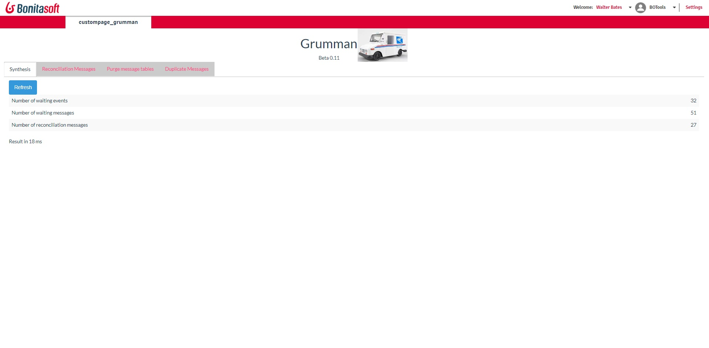
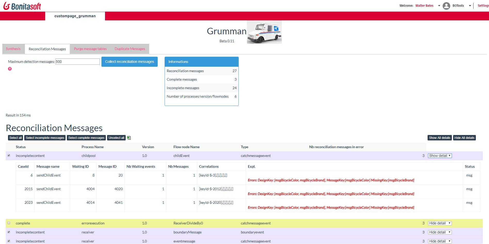
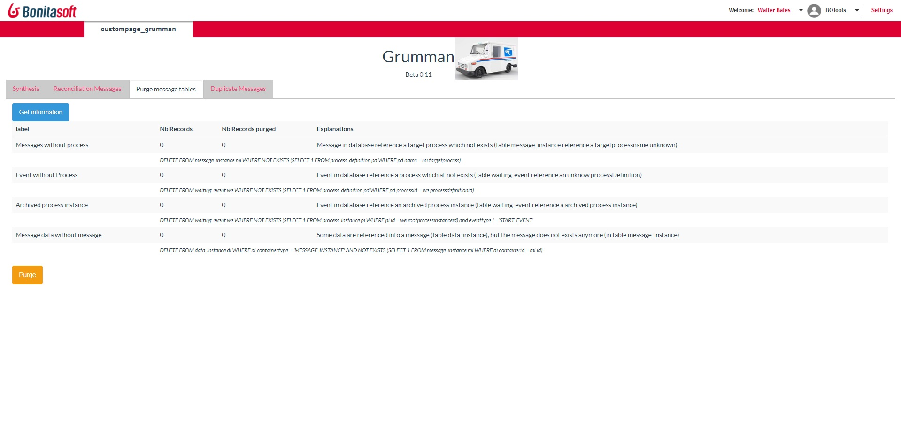
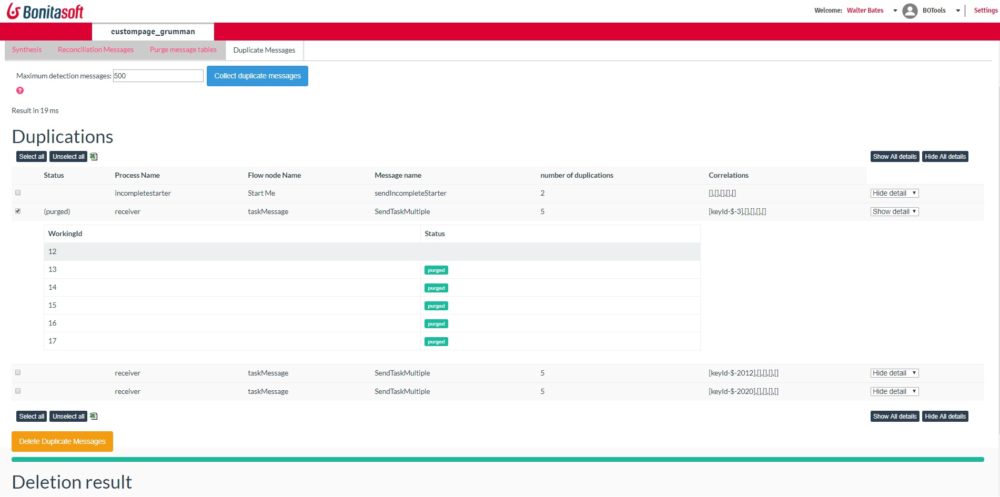

# Page Grumman

The page analyse your messages usage, and fixe issues. See the "Practices to avoid" message.

## Synthesis

 

The synthesis counts the number of records in each table: waiting_event and waiting_message.
It gives you the number of “reconciliation message”.

## Reconciliation messages
A Reconciliation message is a message that should have been executed: 
•	A message is sent
•	A Process Instance, matching the same Correlation key, is waiting

 

Multiple reasons explain why the reconciliation is not done by Bonita:
1.	Message content is incorrect (named as IncompleteContent).
During the reception, the process except for some variable inside the message. The message does not fulfill this content. BonitaStudio display a warning when some content is missing

When the message is sent by the JAVA or REST API, no protection can be done in advance. 
The Bonita Engines does not know how to fulfill the different variable, then provide an error.
Grumman Page correction:
The page detects which message’s content is missing and sends a message with all the information needed. The missing information is sent with a null value. Then, the waiting_message is deleted (one waiting message only).
Developer correction:
The developer must verify why the message is not complete, then send a complete message.
2.	Incorrect operation (named as Complete)
The message is complete, and all information is provided. But during activities attached to the reception of the message, an error occurs. 
This may arrive when the list of operations is incorrect (missing variables, or missing operand).

Grumman Page correction:
Page look at the list of operations, and execute them when it’s possible, doing the affection. Then, it executes an “ExecuteFlowNode” on the message. This call does not execute the message’s operation.
Then, the waiting_message is deleted (one waiting message only).
Developer correction:
Check the list of operations.

## Purge messages tables
Some messages where created, but the process is deactivated and removed. These messages will never be consumed.
The only way to detect these messages is to run some queries in the Bonita Engine database.

 

Grumman Page correction:
The page runs a delete in the Bonita Database.

## Duplicate message
A message (same target process, same correlation key) can be duplicated.
It’s easy to do that when messages are sent by the API, and the sender does not verify if a message for this correlation key is present before.
Attention, in BPMN, this may be a normal situation. You may have three messages with the same correlation key, attending three process instances to match these three messages. The situation has to be analyzed process per process.

 

# Practices to avoid

Messages are saved forever, and one message match one case. One event is freezing until a message arrived.
Saying that: the practice to avoid are the following

## Unblock process instance
A process instance is freezing in an event until a message will unlock it. There are no timeout or boundary timer on an event. So, each process instance must have at one moment a message which matches it.

## Consume each message
Each message must be consumed. Different aspect has to be taken into account:
•	Do not send a message where no process instance will be matched
•	Do not send multiple messages. If the message is sent by the API, there is no control from the Bonita engine to control is a message already exists, because it’s possible to send two messages “Blue Chevrolet” to unlock two process instances. When multiple messages match a process instance, only one message is removed. Others stay in the message_instance table.
•	When a receiver is a boundary event, do not send the message if the process instance is not in the task, or will never come again in the task. 
•	When the receiver is a Sub Process Event, this is the same situation. If the case is already archived, the message will be saved forever.
Note: see Best Advice usage; you may use a different construction.

## Verify the content of the message
A message is supposed to be an internal emission between two processes. Studio checks the content of the message. Then, for example, if the design affects a variable from the value “message.motorOfCar”, and this content does not exist in the definition message, the studio detects it and produces an error at the design level.
So, when the message is sent by the API and is not correct, the Bonita Engine executes the message, and face an error. In that situation, message and process instances are stuck.
If the sender is not “safe”, the best approach is to use a Human task. A human task has a Contract, and then the Bonita Engine check if all data are correctly provided. If not, an error is produced, and task stays in the same situation 
 
